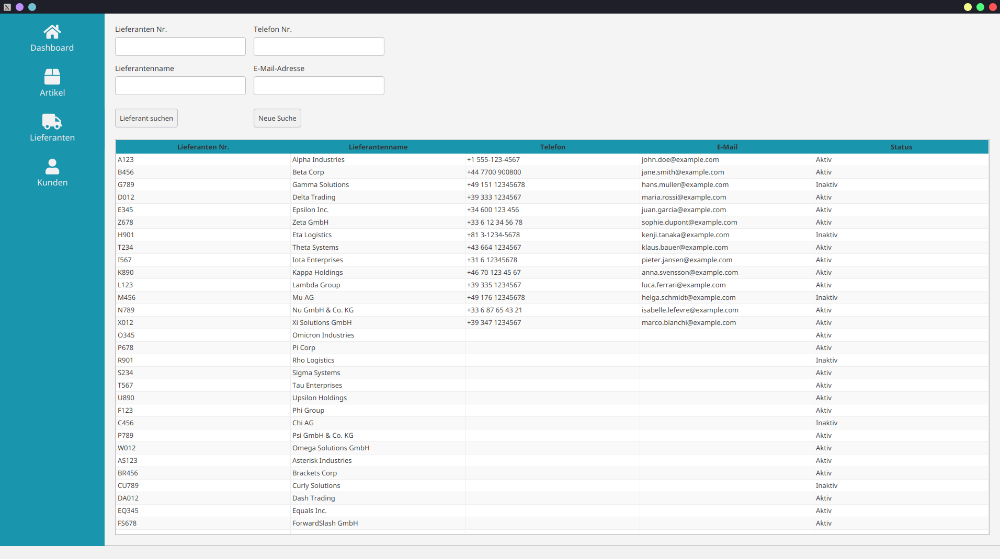

# ecom-manager

## ✨ Projektbeschreibung

**ecom-manager** ist eine JavaFX-Desktop-Anwendung zur Verwaltung von E-Commerce-Daten, darunter Lieferanten, Kunden und Artikel. Die Anwendung nutzt eine SQLite-Datenbank zur Speicherung und Verwaltung der Daten.

## ⚙️ Features

- 📅 Verwaltung von **Lieferanten**
- 👥 Verwaltung von **Kunden**
- 📚 Verwaltung von **Artikeln**
- 🛠 SQLite-Unterstützung für persistente Datenspeicherung
- 🌐 Benutzeroberfläche mit JavaFX

## 🛠 Installation & Setup

### Voraussetzungen

- Java **21** oder höher
- [Git](https://git-scm.com/)

### Installation

```bash
# Repository klonen
git clone https://github.com/TarekSCodes/ecom-manager.git
cd ecom-manager

# Projekt mit Maven bauen
mvn clean install
```

### Anwendung starten

```bash
mvn javafx:run
```

## 📚 Technologien

- **Programmiersprache:** Java 21
- **UI-Framework:** [*JavaFx 23*](https://github.com/openjdk/jfx)
- **Datenbank:** [*SQLite JDBC Driver*](https://github.com/xerial/sqlite-jdbc)
- **Build-Tool:** [*Maven 3.13.0*](https://github.com/apache/maven)

## 📷 Screenshots



## ✉ Kontakt

*Autor: * [*TarekSCodes*](https://github.com/TarekSCodes)

## 🌐 Lizenz

Dieses Projekt steht unter der **GPL-Lizenz**.

